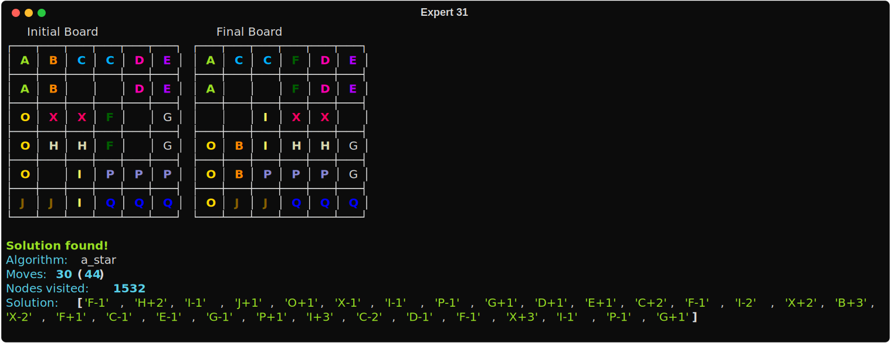
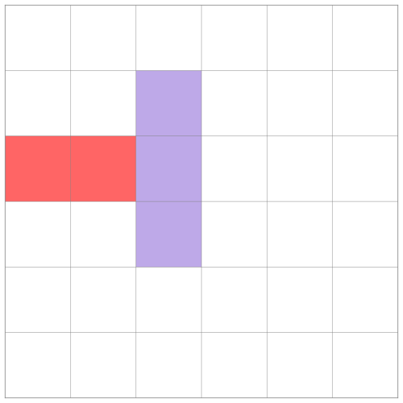
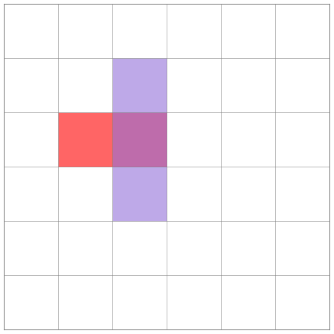
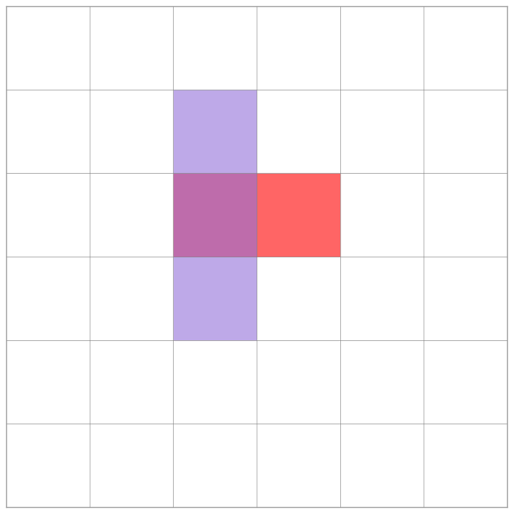
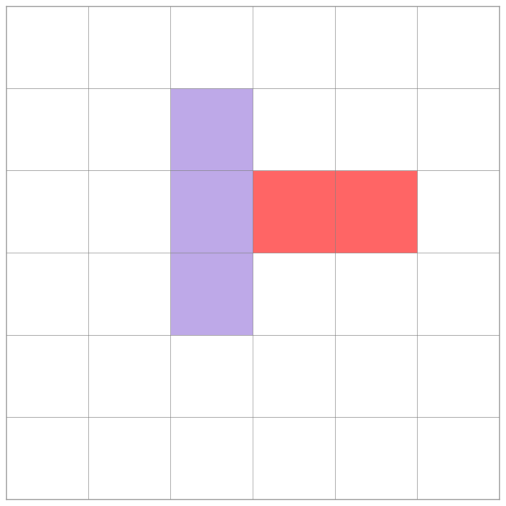

# Two different approaches to solving the Rushhour puzzle 🚗

I implemented these solutions purely for fun. They solve [this challenge](https://twaclaw.github.io/posts/projects/programming_challenge/).

I tackled the problem in two different ways:

- Using standard space-search strategies (BFS and $A^{*}$). See [Python solver](#python-solver).
- Implementing it declaratively using [JuMP](https://jump.dev/), an algebraic modeling language for mathematical programming in Julia. See [JuMP solver](#jump-solver).


## Python solver

### Installation

```bash
git clone https://github.com/twaclaw/rushhour_solution.git
cd rushhour_solution
uv venv --python=python3.13
uv pip install -e .
```

### Execution

See [examples](./examples) to see how to define the input configuration.

```bash
rushhour --help

# Defaults to A* (--algorithm astar)
rushhour --conf examples/expert31.json  solve
rushhour --conf examples/expert31.json  solve --algorithm bfs

# To draw all the board positions in the solution
rushhour --conf examples/expert31.json  --draw-steps solve

# To verify a solution, provided the input file has the field "solution"
rushhour --conf examples/beginner10.json  --draw-steps verify
```

Here is an example of the output:





## JuMP solver


This is a formulation of the Rush Hour puzzle as a Mixed Integer Linear Program (MILP) using [JuMP](https://jump.dev/).


### Installation

The following packages are required. The versions indicate the ones I used to test. Besides `Julia v1.11.6`,  you will need  `JuMP v1.28.0`, `HiGHS v1.19.0` (the solver), and `JSON v0.21.4`.


### Execution

The model is defined in [rushhour.jl](./jump/rushhour.jl). It actually implements three slightly different models. I kept them together because they share most of the code. The script can be invoked as follows:

```bash
julia rushhour.jl <input_file>  {model0|model1|model2}
```

For instance:

```bash
julia rushhour.jl ../examples/beginner10.json model2
```

###  Models

The crux of this formulation is the constraint that ensures cars of length two cannot "tunnel" through other cars. This is not an issue for cars of length three because the non-overlapping constraint guarantees that all moves are valid.

As shown in the figure below, the two moves in the middle ($+1$, $+2$) are not problematic because they are accounted for by the non-overlapping constraint. However, the move on the far right is problematic because the red car would go through the purple car.



*Figure. A car with a length of 2 starts in the third row, first column. It moves right, in a single time step,  by 1, 2, and 3 tiles, respectively.*


#### Model 0

This is the base model. It restricts cars from moving more than one tile per turn. This condition prevents tunneling. The objective function is the number of steps it takes to move car $X$ 🚗 to the exit.

This model solves a normalized version of the puzzle. The optimal value is the number of one-tile moves required to solve the puzzle. This number is equal to the number of one-tile moves in the optimal solution. Unfortunately, there is no one-to-one correspondence between one-tile moves and actual moves. The solution obtained by aggregating one-tile moves generally does not correspond to the optimal solution. You can think of this solution as an upper bound though.


#### Model 1

This model builds on Model 0. It introduces the variable `nmoves` to indirectly count the actual number of moves. A move is defined as any car, different than the car in the previous `turn`, moving any number of tiles. The objective function is the sum over `nmoves`. The resulting sequence is the optimal one, but the objective value does not represent the actual number of moves (at least not directly). This objective function *is not well-behaved*, and the problem can become intractable for larger instances.


#### Model 2

This model uses the same objective function as in Model 0 but it allows cars to move more than one tile per turn. To prevent tunneling, it introduces a `mask` representing the tiles between the starting and the end positions of a single move. This constraint, which is active only if `turn=1`, is added to the board as if it were an additional dimension.


### In-depth explanation

For a detailed explanation of the approach, check [this post](https://twaclaw.github.io/posts/projects/optimizing_rushhour).


## Further Reading

- This is a [very interesting article](https://www.michaelfogleman.com/rush/) by [Michael Fogleman](https://www.michaelfogleman.com/) enumerating a list of starting positions. I used some of the *hard* instances to test my solvers.