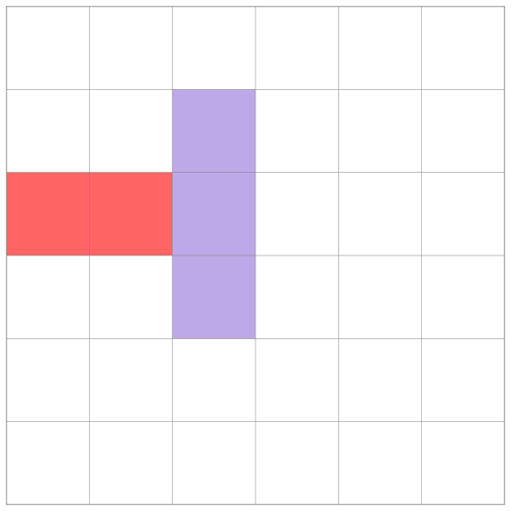

# Formulating RushHour as an optimization problem using JuMP

This is a formulation of the Rush Hour puzzle as a Mixed Integer Linear Program (MILP) using [JuMP](https://jump.dev/).

I tested it with `Julia v1.11.6`,  `JuMP v1.28.0`, and `HiGHS v1.19.0`.

The model is defined in [rushhour.jl](./rushhour.jl). It actually implements three slightly different models. I kept them together because they share most of the code. The script can be invoked as follows:

```bash
julia rushhour.jl <input_file>  {model0|model1|model2}
```

For instance:

```bash
julia rushhour.jl ../examples/beginner10.json model2
```

## Models

The crux of this formulation is the constraint that ensures cars of length two cannot "tunnel" through other cars. This is not an issue for cars of length three because the non-overlapping constraint guarantees that all moves are valid.

As shown in the figure below, the two moves in the middle ($+1$, $+2$) are not problematic because they are accounted for by the non-overlapping constraint. However, the move on the far right is problematic because the red car would go through the purple car.



*Figure. A car with a length of 2 starts in the third row, first column. It moves right, in a single time step,  by 1, 2, and 3 tiles, respectively.*


### Model 0

This is the base model. It restricts cars from moving more than one step per turn. This condition prevents tunneling. The objective function is the number of steps it takes to move car $X$ 🚗 to the exit.

This model solves a normalized version of the puzzle. The optimal value is the number of one-tile moves required to solve the puzzle. This number is equal to the number of one-tile moves in the optimal solution. Unfortunately, there is no one-to-one correspondence between one-tile moves and actual moves. The solution obtained by aggregating one-tile moves generally does not correspond to the optimal solution. Nevertheless, this solution constitutes an upper bound on the optimal solution.


### Model 1

This model builds on Model 0. It introduces additional variables to indirectly count the actual number of moves. A move is defined as a car moving any number of tiles in one turn. The objective function is changed to minimize the effective number of moves. Even if the obtained sequence is optimal, the objective value does not represent the actual number of moves. In general, this objective function is not well-behaved, and the problem can become intractable for larger instances.


### Model 2

This model uses the same objective function as in Model 0 but it allows cars to move more than one tile per turn. To prevent tunneling, it introduces a `mask` representing the tiles between the starting and the end positions of a single move. This mask constraint, which is active only if `turn=1` and is added to the board as if it were an additional dimension. In this case, the objective function represents the number of moves required to bring car $X$ 🚗 to the exit.